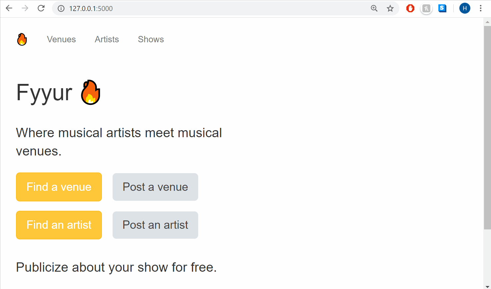

# Fyyur

## Introduction

This project is part of the Udacity Full Stack Developer Nano Degree. The goal of this project is to:
- Connect a web app to a PostgreSQL database (local connection)
- Implement data models in relational, normalized form.
  - Create models using SQLAlchemy syntax: Artists, Shows, Venues  with the proper attributes, constraints and relationship to satisfy the needs of this application. 
- Use SQL to select records, create records and conduct joined queries.
- Create a web app that builds successfully and runs without errors



## App functionalities

Fyyur is a musical venue and artist booking site that facilitates the discovery and bookings of shows between local performing artists and venues. This site lets you list new artists and venues, discover them, and list shows with artists as a venue owner.

## Getting started

### Pre-requisites and Local Development 
Developers using this project should already have Python3, pip and node installed on their local machines.


### Tech Stack

From the starter_code folder run `pip install requirements.txt`. All required packages are included in the requirements file. 

Before running the application, make sure you have postgres installed on your local machine. Then add add DB_USER and DB_PASS to your environment variable

```
export DB_USER=<your_username>
export DB_PASS=<your_password>
```

or replace the following fields on the 01_fyyur/models.py file

```
db_user = <your_username>
db_password = <your_password>
```

To run the application, run the following commands: 
```
export FLASK_APP=app.py
export FLASK_ENV=development
flask run
```

If running locally on Windows, look for the commands in the [Flask documentation](http://flask.pocoo.org/docs/1.0/tutorial/factory/).

The application is run on `http://127.0.0.1:5000/` by default and is a proxy in the frontend configuration. 

## Deployment N/A

## Authors
Helene Misonne

## Acknowledgements 
I want to thank Udacity for providing the framework and guidelines for this great project.
